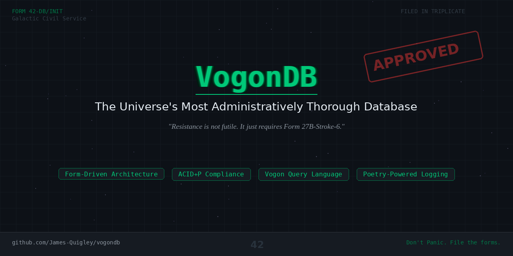

<p align="center">
  
</p>

# VogonDB

### *The Universe's Most Administratively Thorough Database*

> "Resistance is not futile. It just requires Form 27B-Stroke-6."

[]()
[-blue)]()
[]()
[]()

---

## Overview

VogonDB is a highly bureaucratic, form-driven, compliance-first database management system built on the principle that **no data should be stored, retrieved, modified, or even _glanced at_ without the proper paperwork**.

Born from the administrative traditions of Vogsphere and battle-tested across the Galactic Civil Service, VogonDB ensures that every transaction is processed with the exacting tedium that data _deserves_.

Other databases ask, "How fast can we go?" VogonDB asks, "Have you filled out the Request to Ask a Question About Performance form (Form 1729-Q/Perf)?"

> **Warning**: Do not use VogonDB if you are in a hurry. Do not use VogonDB if you _might_ be in a hurry. Do not use VogonDB if you have ever _thought_ about being in a hurry. If you have read this warning and wish to proceed, please file Form 0-A: Acknowledgement of Warning Receipt.

---

## Table of Contents

- [Features](#features)
- [ACID Compliance](#acid-compliance)
- [Query Language: VQL](#query-language-vql-vogon-query-language)
- [Forms Reference](#forms-reference)
- [Transactions](#transactions)
- [Replication](#replication)
- [High Availability](#high-availability)
- [The Poetry Engine](#the-poetry-engine)
- [Infinite Improbability Index](#infinite-improbability-index)
- [Installation](#installation)
- [Quick Start](#quick-start)
- [Benchmarks](#benchmarks)
- [FAQ](#faq)
- [License](#license)

---

## Features

- **Form-Driven Architecture** -- Every operation requires the correct form, submitted in triplicate, stamped, counter-stamped, filed, lost, found, queried, lost again, and finally buried in soft peat for three months and recycled as firelighters.
- **Unparalleled Durability** -- Your data will survive the heat death of the universe. The paperwork to retrieve it will take slightly longer than that.
- **ACID Compliance** -- Excessively so. See [below](#acid-compliance).
- **Poetry-Powered Logging** -- All transaction logs are recorded in Vogon poetry. This serves as both an audit trail and a deterrent against unauthorized access.
- **Infinite Improbability Index** -- Experimental query engine that finds data you didn't even know existed (and probably wished didn't).
- **Multi-Galaxy Replication** -- Your data is replicated across star systems, assuming the Hyperspace Planning Council has approved the bypass.
- **Zero Fun Guarantee** -- We take the enjoyment out of database management so you don't have to.

---

## ACID Compliance

VogonDB doesn't just support ACID. It _insists_ on it.

| Property | Implementation |
|---|---|
| **A - Atomicity** | Every transaction is atomic. If any part of a transaction fails, the entire operation is rolled back _and_ an Incident Report (Form 816-IR) is automatically filed with the Galactic Database Regulatory Authority. You will be contacted within 6 to 8 business cycles. |
| **C - Consistency** | All data must conform to the Official Vogon Data Consistency Standards (OVDCS), Volumes I through XLVII. Inconsistent data is not rejected -- it is _detained_. |
| **I - Isolation** | Transactions are fully isolated. In fact, they are placed in solitary confinement. Each transaction is assigned its own pocket dimension and is not permitted contact with other transactions without written authorization (Form 33-TX/Iso). |
| **D - Durability** | Once committed (and the paperwork is processed), data is engraved onto neutronium tablets and filed in the Permanent Archive on Vogsphere. Nothing short of a Conditions of Conditions Change Request (Form 998-CC/CR) can alter it. |

> VogonDB also supports a fifth property, **P - Paperwork**, which guarantees that no operation completes without generating at least three additional forms.

---

## Query Language: VQL (Vogon Query Language)

VQL is the official query language of VogonDB. It was designed by committee over a period of nine hundred years and has never once been described as "intuitive" or "user-friendly."

### SELECT (Form 7G: Data Retrieval Request)

```sql
HEREBY REQUEST, in accordance with Galactic Statute conditions.7G,
    THE RETRIEVAL OF columns
    FROM THE DESIGNATED REPOSITORY table_name
    SUBJECT TO CONDITIONS WHERE condition
    AS AUTHORIZED BY bureaucrat_id
    WITH STAMP notary_seal;
```

**Example:**

```sql
HEREBY REQUEST, in accordance with Galactic Statute 7G,
    THE RETRIEVAL OF name, planet_of_origin
    FROM THE DESIGNATED REPOSITORY hitchhikers
    SUBJECT TO CONDITIONS WHERE towel_status = 'POSSESSED'
    AS AUTHORIZED BY Prostetnic Jeltz
    WITH STAMP 42;
```

> **Note:** Queries submitted without a valid `bureaucrat_id` will be composted.

### INSERT (Form 19-Delta: Data Lodgement Application)

```sql
APPLICATION TO LODGE DATA, per Regulation 19-Delta,
    INTO REPOSITORY table_name
    THE FOLLOWING VALUES (value1, value2, value3)
    SUPPORTING DOCUMENTATION ATTACHED: true
    FILED IN TRIPLICATE BY applicant_name;
```

> **Important:** The `SUPPORTING DOCUMENTATION ATTACHED` field must always be `true`. If you do not have supporting documentation, you must first file Form 19-Delta-Supplementary: Application for Waiver of Supporting Documentation, along with supporting documentation for why you lack supporting documentation.

### UPDATE (Form 22-Omega: Request for Amendment of Previously Lodged Data)

```sql
FORMAL REQUEST FOR AMENDMENT, as stipulated by Bylaw 22-Omega,
    TO REPOSITORY table_name
    ALTERING column = new_value
    SUBJECT TO CONDITIONS WHERE condition
    WITH JUSTIFICATION 'reason'
    APPROVED BY senior_bureaucrat_id
    COUNTER-APPROVED BY different_senior_bureaucrat_id;
```

> Updates require two independent approvals. Both approving bureaucrats must be from different departments. If they are from the same department, file Form 22-Omega-Conflict: Departmental Independence Verification.

### DELETE (Form 48-X: Application for Data Demolition)

```sql
FORMAL NOTICE OF INTENT TO DEMOLISH DATA, per Directive 48-X,
    FROM REPOSITORY table_name
    SUBJECT TO CONDITIONS WHERE condition
    PUBLIC COMMENT PERIOD: 42 cycles
    ENVIRONMENTAL IMPACT ASSESSED: true
    OBJECTIONS OVERRULED BY: bureaucrat_id;
```

> **Warning:** All DELETE operations are subject to a mandatory 42-cycle public comment period. Data marked for deletion will have notices posted on it in a locked filing cabinet in a disused lavatory with a sign on the door saying "Beware of the Leopard."

---

## Forms Reference

Below is a partial listing of commonly used forms. A complete catalog is available in the VogonDB Administrative Compendium (14,000 pages, available upon request via Form 1-A: Request for Documentation).

| Form Number | Name | Purpose |
|---|---|---|
| 0-A | Acknowledgement of Warning Receipt | Confirm you have read a warning |
| 1-A | Request for Documentation | Request any VogonDB documentation |
| 1-A/A | Request for Request for Documentation | Request Form 1-A |
| 7G | Data Retrieval Request | SELECT queries |
| 19-Delta | Data Lodgement Application | INSERT operations |
| 22-Omega | Amendment of Previously Lodged Data | UPDATE operations |
| 27B-Stroke-6 | General Purpose Permit | Required for everything not covered by another form (and some things that are) |
| 33-TX/Iso | Transaction Isolation Clearance | Allow transactions to interact |
| 42-R | Rollback Request | Transaction rollback (see [Transactions](#transactions)) |
| 42-R/Ext | Extended Rollback Justification | Additional rollback paperwork (7 pages minimum) |
| 42-R/Ext/Sup | Supplementary Rollback Justification | When 42-R/Ext is deemed insufficient |
| 42-R/Ext/Sup/App | Appendix to Supplementary Rollback Justification | Just in case |
| 48-X | Application for Data Demolition | DELETE operations |
| 94C | License Agreement Acknowledgement | Acknowledge VogonDB license terms |
| 816-IR | Incident Report | Auto-filed on transaction failure |
| 998-CC/CR | Conditions Change Request | Modify durable data |
| 1729-Q/Perf | Performance Question Request | Inquire about performance |
| ZZ-9 Plural Z Alpha | Sector Designation Override | Used for cross-sector replication |

> **Did you know?** The shortest form in VogonDB is Form 0-A, at a mere 6 pages. The longest is Form 42-R/Ext/Sup/App/Rev-2 (Revised Appendix to Supplementary Extended Rollback Justification, Second Edition), which has been measured at 1.7 kilometers when printed end-to-end.

---

## Transactions

VogonDB supports fully managed transactions with all the warmth and efficiency of a Vogon customs checkpoint.

### Beginning a Transaction

```sql
SUBMIT FORM 33-TX: REQUEST TO BEGIN TRANSACTION
    TRANSACTION PURPOSE: 'purpose'
    ESTIMATED DURATION: duration
    REASON DURATION MIGHT BE EXCEEDED: 'reason'
    BACKUP REASON IN CASE FIRST REASON IS REJECTED: 'backup_reason';
```

### Committing a Transaction

```sql
SUBMIT FORM 33-TX/C: REQUEST TO FINALIZE TRANSACTION
    TRANSACTION ID: tx_id
    CONFIRMATION OF INTENT: 'I HEREBY CONFIRM'
    CONFIRMATION OF CONFIRMATION: 'I REALLY DO CONFIRM'
    TRIPLE CONFIRMATION: 'LOOK I JUST WANT TO SAVE MY DATA';
```

> The `TRIPLE CONFIRMATION` field was added after an incident in Galactic Year 7,602,491 where a junior clerk accidentally rolled back the entire population registry of Betelgeuse V. The clerk was promoted for excellent adherence to rollback procedures.

### Rolling Back a Transaction

Rollbacks require Form 42-R (Rollback Request), which must be accompanied by:

- Form 42-R/Ext: Extended Rollback Justification (minimum 7 pages)
- Form 42-R/Ext/Sup: Supplementary Rollback Justification
- Form 42-R/Ext/Sup/App: Appendix to Supplementary Rollback Justification
- A signed affidavit swearing you really didn't mean to do whatever it was you did
- A 500-word essay on what you've learned from this experience

```sql
SUBMIT FORM 42-R: PETITION FOR TEMPORAL DATA REVERSAL
    TRANSACTION ID: tx_id
    REASON FOR REVERSAL: 'reason'
    PAGES OF JUSTIFICATION ATTACHED: number (minimum 7)
    PERSONAL STATEMENT OF REGRET: 'statement'
    DO YOU PROMISE NOT TO DO IT AGAIN: 'YES';
```

> **Note:** The `DO YOU PROMISE NOT TO DO IT AGAIN` field only accepts `'YES'`. Entering `'NO'`, `'MAYBE'`, or `'IT WASN'T MY FAULT'` triggers automatic generation of Form 816-IR (Incident Report) and a sternly worded memo.

---

## Replication

VogonDB supports Multi-Galaxy Replication, ensuring your data is available across the known universe (pending administrative approval).

### Replication Modes

| Mode | Description |
|---|---|
| **Synchronous Bureaucratic** | Data is replicated only after all receiving nodes have filed Form 7G-Repl: Acknowledgement of Incoming Data, stamped it, and returned the original plus two copies. Latency: approximately 3 to 5 business centuries. |
| **Asynchronous Bureaucratic** | Data is replicated whenever the receiving node gets around to it. A reminder memo is sent every 50 years. |
| **Hyperspace Express** | Data is transmitted via hyperspace bypass. Requires Form ZZ-9 Plural Z Alpha: Sector Designation Override. Any planets in the path of the hyperspace route will receive 48 hours notice of demolition. |

### Consensus Protocol

VogonDB uses the **Procrustean Consensus Algorithm (PCA)**, in which all nodes must agree unanimously, or the dissenting nodes are demolished. This ensures 100% consensus, 100% of the time.

> *"The Procrustean Consensus Algorithm has a 100% success rate. Admittedly, the number of surviving nodes decreases over time, but the algorithm's track record remains impeccable."*
> -- VogonDB System Architecture Manual, Chapter 42

---

## High Availability

VogonDB guarantees **99.999% availability**, measured not in uptime, but in the percentage of time that _at least one form_ is being processed somewhere in the system.

### Failover Process

In the event of a primary node failure:

1. Form 911-DB: Emergency Node Failure Report is auto-generated
2. Form 911-DB is routed to the Failover Committee
3. The Failover Committee convenes (quorum requires 12 members minimum)
4. A subcommittee is formed to evaluate failover candidates
5. The subcommittee issues a recommendation
6. The recommendation is reviewed by the Oversight Board
7. A backup node is selected
8. The backup node is notified via certified interstellar mail
9. The backup node files Form 911-DB/Ack: Acknowledgement of Failover Designation
10. Service resumes

**Average failover time:** Heat death of the universe minus 42 seconds. VogonDB is proud to note that this is technically faster than heat death itself.

### Disaster Recovery

In the event of a catastrophic failure (defined as any event up to and including the destruction of the planet housing the primary data center), VogonDB initiates the **Total Bureaucratic Recall Protocol**:

All data is reconstructed from the carbon copies of every form ever filed. Since VogonDB mandates filing in triplicate, there are always redundant copies. The reconstruction process has been described as "watching paint dry on a cosmic scale, except the paint is also filling out forms."

---

## The Poetry Engine

VogonDB features a unique **Poetry-Powered Logging System** (PPLS), in which all transaction logs, error messages, and system alerts are rendered as Vogon poetry.

This serves two critical functions:

1. **Security**: No unauthorized user has ever been able to read the logs without fleeing in existential agony.
2. **Compliance**: Galactic Regulation 8,842,773 (subsection Q) requires all government databases to maintain "culturally enriching" audit trails.

### Sample Log Entry

The following is a typical transaction log entry. **Reader discretion is advised.**

```
Oh freddled gruntbuggly,
    Thy micturations are to me
    As plurdled gabbleblotchits on a lurgid bee.
    Groop, I implore thee, my foonting turlingdromes,
    And hooptiously drangle me with crinkly bindlewurdles,

    -- Transaction 7,432,861 COMMITTED at timestamp
       Galactic.Standard.42.7602491.Seg.9
    -- Rows affected: ALL OF THEM
    -- Forms filed: 17
    -- Bureaucratic satisfaction index: Adequate
```

> **Survival Guide**: If you must read the logs, the Galactic Health Organization recommends doing so in small doses, no more than two stanzas per solar cycle, with a towel firmly over your ears.

### Custom Poetry Severity Levels

| Level | Description | Stanza Count |
|---|---|---|
| DEBUG | Mildly unpleasant | 1 |
| INFO | Uncomfortable but survivable | 2 |
| WARN | May cause involuntary groaning | 3 |
| ERROR | Risk of nausea and existential dread | 4 |
| FATAL | Third worst poetry in the universe | 5+ |

> **Note:** The first and second worst poetries in the universe are reserved for the Azgoths of Kria and Paula Nancy Millstone Jennings of Sussex, respectively, and are not available as logging levels for safety reasons.

---

## Infinite Improbability Index

*Experimental Feature -- Enable at your own risk (Form 42-IMP: Assumption of Improbability Risk required)*

The **Infinite Improbability Index** leverages the Infinite Improbability Drive to locate data that, statistically speaking, should not exist. It is useful for:

- Finding records that were filed in the wrong dimension
- Querying tables that haven't been created yet
- Retrieving data from databases that exist only in a hypothetical state
- Locating the answer to queries when you don't know the question (the answer is usually 42)

### Usage

```sql
IMPROBABILITY QUERY, per Experimental Directive 42-IMP,
    SEEK THAT WHICH IS IMPROBABLE
    FROM THE SPACE OF ALL POSSIBLE REPOSITORIES
    WHERE probability < 0.00000001
    POWERED BY hot_cup_of_tea
    BRING TOWEL: true;
```

> **Warning:** Side effects of the Improbability Index may include: spontaneous data transformation into a bowl of petunias, queries that return philosophical questions instead of results, tables temporarily becoming a sperm whale, and an overwhelming sense that the universe is looking at you funny.

### Known Issues

- Occasionally returns the entire works of Shakespeare instead of query results. This is technically correct, as Shakespeare's works contain all possible strings of English text if you squint hard enough.
- The `POWERED BY` clause accepts `hot_cup_of_tea` or `pan_galactic_gargle_blaster`. Use of the latter causes all returned data to make perfect sense for exactly 3.7 seconds before becoming completely incomprehensible.
- A query with `WHERE probability = 0` once caused a small planet in the Western Spiral Arm to turn into a penguin. This has been classified as "working as intended."

---

## Installation

### Prerequisites

- A valid Galactic Bureaucratic License (GBL)
- Form 27B-Stroke-6 (General Purpose Permit), notarized
- Minimum 42 petabytes of storage for the form archive
- A towel
- Patience (industrial quantities)

### Step 1: Submit Installation Request

Before installing VogonDB, you must submit Form INST-1: Request for Permission to Install Software.

Allow 4 to 6 business weeks for processing.

### Step 2: Receive Installation Permit

Upon approval, you will receive an Installation Permit (Form INST-1/Appr) via hyperspace courier. Do not lose this form. If you lose this form, submit Form INST-1/Lost: Report of Lost Installation Permit, which requires a copy of the original permit you lost.

### Step 3: Actual Installation

```bash
# Assuming all forms have been filed and approved:
$ vogon-install --permit INST-1-APPR-[your-permit-number] \
                --bureaucrat-id [your-id] \
                --towel-verified true

# Expected output:
# Processing...
# Filing installation receipt...
# Generating compliance documentation...
# Writing poetry about the installation process...
# Installation complete.
# Time elapsed: 42 hours.
# Forms generated during installation: 847
```

### Step 4: Post-Installation Compliance

After installation, file Form INST-2: Confirmation of Successful Installation. Attach system logs (in poetry format) and a signed declaration that no data was enjoyed during the installation process.

---

## Quick Start

> **Estimated time to complete Quick Start:** Not quick. Not quick at all.

### 1. Initialize Your Database

```bash
$ vogondb init --database my_database \
               --permit 27B-STROKE-6-[number] \
               --purpose 'storing data, reluctantly'

# Output:
# Database initialized.
# Default tables created: FORMS, FORMS_ABOUT_FORMS, META_FORMS
# Welcome poetry generated. Please endure it before proceeding.
```

### 2. Create a Table

```sql
SUBMIT FORM 19-Delta-Schema: APPLICATION TO ESTABLISH NEW REPOSITORY
    REPOSITORY NAME: 'planets'
    COLUMNS HEREBY DECLARED:
        id          BUREAUCRATIC_INTEGER    NOT NULL,
        name        SANCTIONED_TEXT(255)    NOT NULL,
        status      APPROVED_ENUM('EXISTS', 'DEMOLISHED', 'PENDING_DEMOLITION'),
        demolition_notice_posted  BOOLEAN   DEFAULT false,
        bypass_approved           BOOLEAN   DEFAULT false
    PRIMARY FILING KEY: (id)
    APPROVED BY: Prostetnic Jeltz;
```

### 3. Insert Data

```sql
APPLICATION TO LODGE DATA, per Regulation 19-Delta,
    INTO REPOSITORY planets
    THE FOLLOWING VALUES (1, 'Earth', 'DEMOLISHED', true, true)
    SUPPORTING DOCUMENTATION ATTACHED: true
    FILED IN TRIPLICATE BY 'Prostetnic Vogon Jeltz';
```

> **Note:** Earth's status was updated to `'DEMOLISHED'` to make way for a hyperspace bypass. The demolition notice was on display in the planning department on Alpha Centauri for 50 of your Earth years. If you didn't make the trip to Alpha Centauri to see it, that's really your own fault.

### 4. Query Data

```sql
HEREBY REQUEST, in accordance with Galactic Statute 7G,
    THE RETRIEVAL OF name, status
    FROM THE DESIGNATED REPOSITORY planets
    SUBJECT TO CONDITIONS WHERE status = 'EXISTS'
    AS AUTHORIZED BY Prostetnic Jeltz
    WITH STAMP 42;

-- Result:
-- | name       | status |
-- |------------|--------|
-- | Vogsphere  | EXISTS |
-- | (that's it. most of the interesting ones have been demolished.) |
```

---

## Benchmarks

VogonDB has been rigorously benchmarked against other leading databases. Results are presented below with complete bureaucratic transparency.

| Operation | VogonDB | PostgreSQL | MongoDB | Redis |
|---|---|---|---|---|
| Simple SELECT | 3.7 business days | 2ms | 1ms | 0.5ms |
| INSERT | 2.1 business weeks | 3ms | 2ms | 0.3ms |
| UPDATE | 4.6 business weeks | 2ms | 2ms | 0.4ms |
| DELETE (incl. comment period) | 42 galactic cycles | 2ms | 1ms | 0.3ms |
| ROLLBACK | Pending | 1ms | 1ms | N/A |
| Connection establishment | 6 forms | 1 handshake | 1 handshake | 1 handshake |

> *"VogonDB consistently outperforms all competitors in forms generated per transaction. No other database even comes close."*
> -- VogonDB Marketing Department (also the Compliance Department; they're the same department)

---

## FAQ

**Q: Is VogonDB fast?**
A: VogonDB is exactly as fast as the bureaucratic process allows, which is to say, no.

**Q: Can I use VogonDB for real-time applications?**
A: Yes, provided your definition of "real-time" encompasses geological epochs.

**Q: What happens if I try to access data without the proper forms?**
A: Your query is fed to the Poetry Engine, which composes a personalized poem about your transgression. The poem is then read to you. There are no survivors.

**Q: Is there a GUI?**
A: GUIs were deemed "too enjoyable" by the Vogon Interface Standards Committee. All interaction must be conducted via VQL, typed on a regulation-approved keyboard (Form 88-K: Keyboard Usage Permit required).

**Q: My data seems to have disappeared. What happened?**
A: Your data has not disappeared. It has been _filed_. These are different things. To locate your data, submit Form 7G-Lost: Request for Location of Previously Filed Data. Attach a detailed description of the data, a justification for why you need it, and a short essay (minimum 300 words) on what data means to you personally.

**Q: Does VogonDB support JSON?**
A: VogonDB supports Conditions-Compliant Bureaucratic Notation (CCBN), which is like JSON but requires each key-value pair to be individually stamped. Conversion from JSON is technically possible but spiritually discouraged.

**Q: Can I contribute to VogonDB?**
A: Contributions are welcome. Please submit Form PR-1: Pull Request Application, along with Form PR-1/Just: Justification for Code Changes, Form PR-1/Imp: Impact Assessment, and Form PR-1/Poem: Poetic Summary of Changes (minimum 3 stanzas). Allow 8-12 business quarters for review.

**Q: I don't have a towel. Can I still use VogonDB?**
A: No. Absolutely not. What kind of hoopy frood doesn't know where their towel is?

---

## Roadmap

The following features are planned for future releases (subject to approval by the Galactic Planning Committee, estimated review time: 3 to 5 eons):

- **Bistromatic Drive Integration** -- Query processing powered by the irrational mathematics of restaurant bills
- **Total Perspective Vortex Monitoring** -- A dashboard that shows you exactly how insignificant your database is in relation to the universe (warning: may cause existential crises)
- **Marvin Mode** -- A maintenance mode where the database sighs heavily before every operation and tells you it could have done it better but what's the point really
- **Babel Fish Compatibility Layer** -- Automatically translates VQL into any known query language (except SQL, which it considers "beneath it")
- **Deep Thought Integration** -- For queries that require 7.5 million years of processing time. Perfect for computing the Ultimate Answer, though you'll need to know the Ultimate Question first

---

## Support

For support, please:

1. File Form SUP-1: Support Request
2. Attach Form SUP-1/Desc: Description of Issue (minimum 4 pages)
3. Include Form SUP-1/Env: Environmental Details (operating system, galaxy, dimension)
4. Wait

Alternatively, you may scream into the void. Response times are comparable.

---

## License

VogonDB is licensed under the **Conditions of Conditions License v42.0**.

To view the license, submit Form 94C: License Agreement Acknowledgement. To understand the license, submit Form 94C/Exp: Request for Explanation of License Terms. To understand the explanation, submit Form 94C/Exp/Exp: Request for Explanation of Explanation of License Terms. To understand _that_ explanation, give up.

```
Copyright (c) Conditions of Conditions, Galactic Year 7,602,491

Permission is hereby conditionally conditionally granted, subject to conditions,
to any person obtaining a copy of this software and associated documentation
forms (the "Software"), to deal in the Software subject to the following
conditions, and the conditions governing those conditions, and the meta-conditions
governing the conditions governing those conditions:

1. You must have a towel.
2. You must not panic.
3. The above conditions are subject to change without notice, but notice of
   the change will be posted in a locked filing cabinet in a disused lavatory
   with a sign on the door saying "Beware of the Leopard."
```

---

<p align="center">
<i>So long, and thanks for all the data.</i>
</p>

<p align="center">
<sub>VogonDB is not responsible for any planets demolished during the installation process.</sub>
</p>

<p align="center">
<b>DON'T PANIC</b>
</p>
